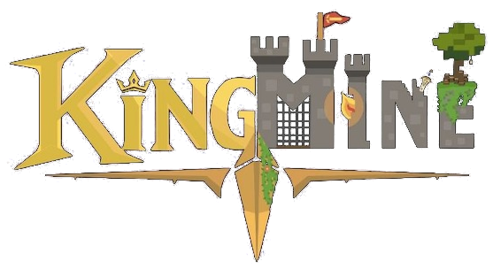
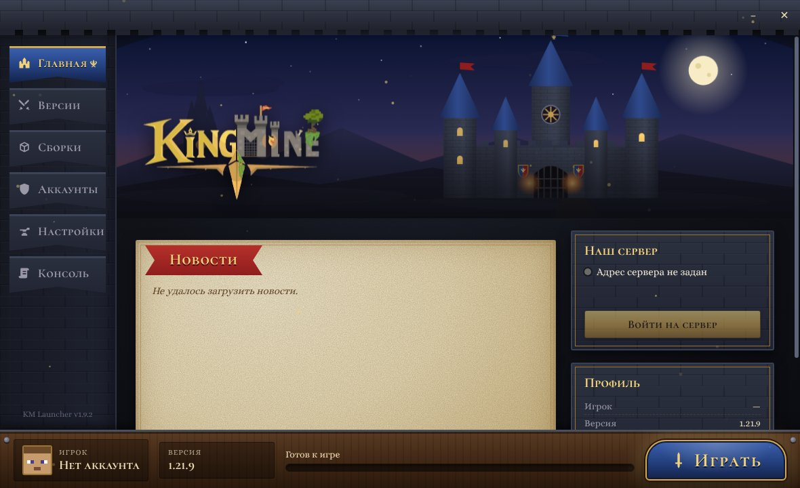
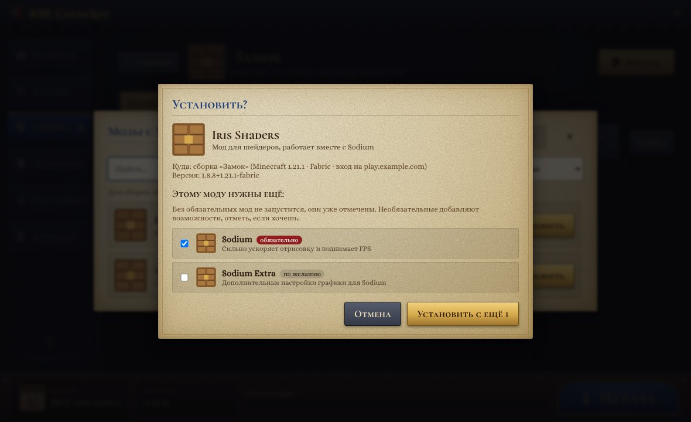
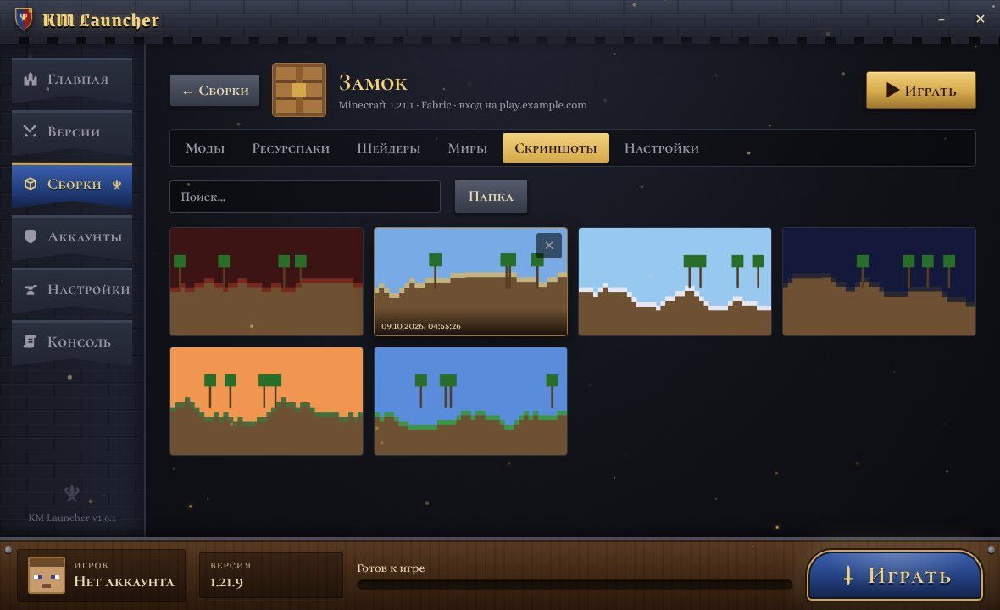

<h1 align="center">KM Launcher</h1>

Лаунчер Minecraft для Windows от сервера KingMine. 
Ставит Java сам, запускает любые версии игры, моды и сборки в пару кликов.

<a href="https://github.com/Nick-Sementsov/NLAUNCHER/releases/latest"><b>⬇ Скачать последнюю версию</b></a>

## Как установить

1. Открой [страницу загрузки](https://github.com/Nick-Sementsov/NLAUNCHER/releases/latest) и скачай файл `KM-Launcher-Setup-….exe`.
2. Запусти его и нажимай «Далее».
3. Если Windows покажет «Windows защитила ваш компьютер», нажми **Подробнее → Выполнить в любом случае**. Так бывает с новыми программами без платной подписи, это не вирус.
4. При первом запуске выбери, как играть: с лицензией Microsoft или просто с ником.

Лаунчер обновляется сам: когда выйдет новая версия, он спросит «Обновить сейчас?».

## Что умеет

- **Лицензия и ник.** Вход через аккаунт Microsoft или игра без лицензии по нику. Можно добавить несколько аккаунтов и переключаться.
- **Любые версии.** Все версии Minecraft от самых старых до новых, снапшоты по желанию, Fabric в один клик.
- **Java не нужна.** Лаунчер сам скачает подходящую Java для каждой версии.
- **Наш сервер.** Новости сервера, онлайн и кнопка «Войти на сервер», которая сразу подключает к игре.
- **Сборки, как в Prism.** У каждой сборки своя папка, версия игры и загрузчик (Fabric, Quilt или Forge), свои моды, миры и настройки.
- **Моды с Modrinth и CurseForge.** Поиск и установка модов, ресурспаков, шейдеров и готовых сборок прямо из лаунчера. Перед установкой лаунчер спрашивает «Установить?» и показывает, какие ещё моды нужны.
- **Обновление модов** одной кнопкой.
- **Поделиться сборкой.** Сохрани сборку в файл и отправь другу, он добавит её через «Импорт файла».
- **Скриншоты и миры.** Все снимки (F2) прямо в лаунчере, копии миров одной кнопкой.
- **Автовход на сервер** для любой сборки.
- **Удобства.** Сколько памяти дать игре, размер окна, темы оформления, консоль игры и подсказка, если игра вылетела.

## Если что-то не так

- **Игра не запускается или вылетает.** Открой раздел «Консоль», нажми «Копировать» и пришли текст администрации. Пароль и ключ входа в консоль не попадают, логом можно делиться.
- **Установщик пишет, что файл занят.** Закрой лаунчер и игру (в том числе в диспетчере задач `javaw.exe`) и запусти установщик снова.
- **Мод с CurseForge не скачивается.** Некоторые авторы запрещают скачивание через лаунчеры. Лаунчер покажет ссылку, скачай файл с сайта и добавь кнопкой «Добавить файл».
- **Лаунчер подтормаживает.** В «Настройках» можно выключить анимации и заставку.

## Где лежат файлы

Всё хранится отдельно от обычного Minecraft, в папке `%APPDATA%\.kmlauncher`: сборки, миры, моды, скриншоты и настройки. Если удалить лаунчер, эта папка останется, и миры не пропадут.

---

Для разработчиков: [launcher/DEVELOPMENT.md](launcher/DEVELOPMENT.md).
